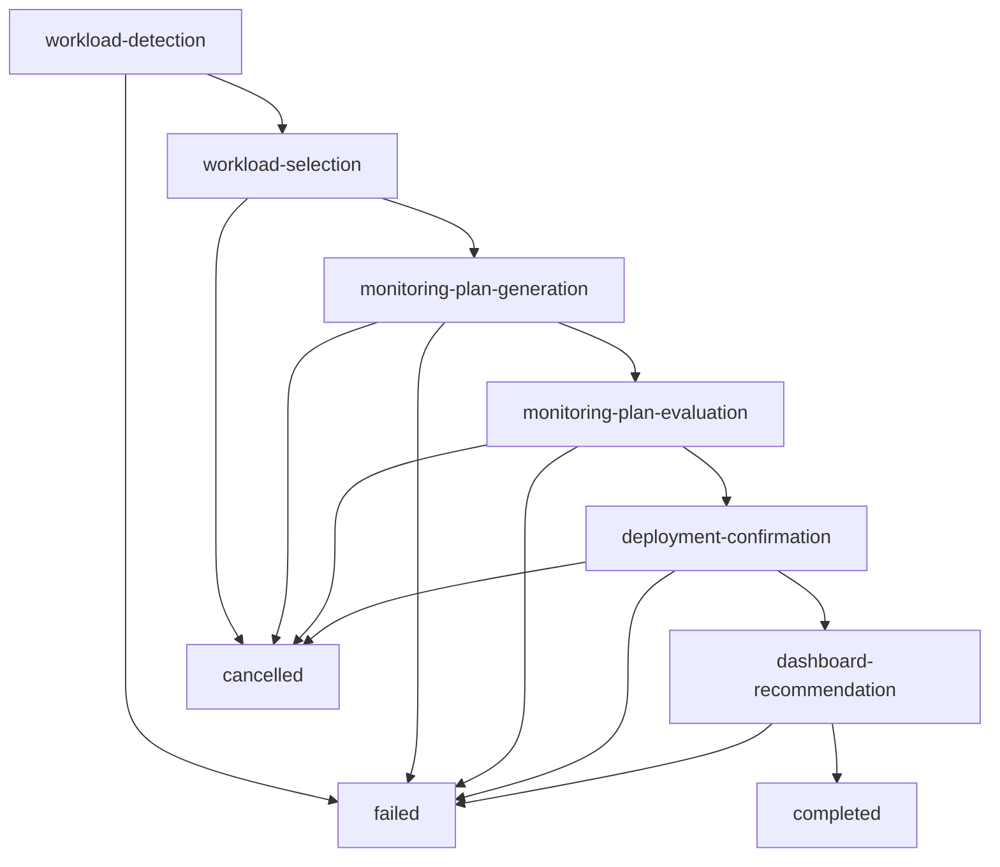

# Workflow State Machine Documentation

## Overview

The system uses a sophisticated state machine to manage the monitoring setup workflow. Each workflow session progresses through distinct phases, with AI agents handling analysis and humans making key decisions.

## Workflow Phases

### Phase 1: workload-detection
**Purpose**: Scan Kubernetes cluster for monitorable services
**Agent**: Workload Detection Agent
**Input**: Kubernetes cluster context
**Output**: List of detected services with OSS classification

```python
# State Structure
{
    "phase": "workload-detection",
    "cluster_data": [...],  # Raw K8s services
    "detected_workloads": [...],  # Processed workload list
    "session_id": "uuid",
    "timestamp": "iso-datetime"
}
```

**AI Prompt Focus**: 
- Identify OSS components that benefit from monitoring
- Filter out system/infrastructure services
- Classify workload types and monitoring potential

### Phase 2: workload-selection
**Purpose**: Human selects which workloads to monitor
**Agent**: None (human decision point)
**Input**: Detected workloads list
**Output**: Selected workloads for monitoring

```python
# Expected Input Format
{
    "selected_workloads": [
        {
            "name": "service-name",
            "namespace": "namespace",
            "type": "postgresql",
            "monitoring_potential": "high"
        }
    ]
}
```

### Phase 3: monitoring-plan-generation
**Purpose**: Generate comprehensive monitoring deployment plans
**Agent**: Monitoring Plan Generator
**Input**: Selected workloads + cluster context
**Output**: Detailed monitoring plan in markdown

```python
# State Addition
{
    "selected_workloads": [...],
    "monitoring_plan": "markdown_plan_text",
    "generation_metadata": {
        "model_used": "gpt-4",
        "tokens": 1500,
        "generation_time": "iso-datetime"
    }
}
```

**AI Prompt Focus**:
- Create comprehensive monitoring strategy
- Include ServiceMonitor configurations
- Specify AlertManager rules
- Reference appropriate Helm charts

### Phase 4: monitoring-plan-evaluation
**Purpose**: Critic agent evaluates and improves the plan
**Agent**: Plan Evaluator (Critic)
**Input**: Generated monitoring plan
**Output**: Evaluation feedback and improved plan

```python
# State Addition
{
    "evaluation_feedback": "detailed_critique_text",
    "improved_plan": "revised_markdown_plan",
    "evaluation_score": 8.5,
    "iterations": 2
}
```

**AI Prompt Focus**:
- Validate technical accuracy
- Check completeness of monitoring coverage
- Suggest improvements and best practices
- Ensure Azure Managed Prometheus compatibility

### Phase 5: deployment-confirmation
**Purpose**: Convert plan to structured instructions and get approval
**Agent**: Instruction Parser
**Input**: Approved monitoring plan
**Output**: Structured deployment instructions

```python
# State Addition
{
    "structured_instructions": [
        {
            "type": "helm",
            "action": "install",
            "chart": "prometheus-community/kube-prometheus-stack",
            "values": {...}
        },
        {
            "type": "kubectl",
            "action": "apply",
            "manifest": "yaml_content"
        }
    ],
    "human_approved": false
}
```

### Phase 6: dashboard-recommendation
**Purpose**: Recommend relevant Grafana dashboards
**Agent**: Dashboard Recommender
**Input**: Deployed monitoring configuration
**Output**: List of recommended dashboards with import instructions

```python
# State Addition
{
    "recommended_dashboards": [
        {
            "name": "PostgreSQL Dashboard",
            "id": "9628",
            "url": "https://grafana.com/grafana/dashboards/9628",
            "description": "Comprehensive PostgreSQL monitoring",
            "compatibility": "verified"
        }
    ]
}
```

## Terminal States

### completed
- All phases executed successfully
- Monitoring infrastructure deployed
- Dashboards recommended and configured
- System ready for production monitoring

### cancelled
- User explicitly cancelled the workflow
- No changes made to cluster
- Session data preserved for analysis

### failed
- Unrecoverable error occurred
- Partial deployment may exist
- Requires manual intervention or retry

## State Transitions



## Checkpointing Strategy

### Automatic Checkpoints
- After each phase completion
- Before any destructive operations
- When human input is required

### Checkpoint Data
```python
{
    "checkpoint_id": "uuid",
    "session_id": "uuid", 
    "phase": "current_phase",
    "state": {...},  # Full workflow state
    "timestamp": "iso-datetime",
    "next_action": "expected_next_step"
}
```

### Recovery Mechanisms
- **Resume from checkpoint** - Continue from last saved state
- **Phase replay** - Re-execute specific phase
- **State reconstruction** - Rebuild state from logs

## Error Handling Patterns

### Recoverable Errors
- AI agent timeout → Retry with different model
- Network failure → Exponential backoff retry
- Validation error → Request corrected input

### Non-Recoverable Errors
- Authentication failure → Require re-authentication
- Insufficient permissions → Escalate to admin
- Cluster unreachable → Manual intervention required

## Performance Considerations

### State Size Management
- Limit cluster data to essential information
- Compress large text outputs
- Archive old workflow sessions

### Concurrency Control
- Session-based isolation
- Resource locks for deployment operations
- Queue management for multiple workflows

## Integration Points

### LangGraph Integration
```python
# Graph node definition
@node
def workload_detection_node(state: WorkflowState) -> WorkflowState:
    # Agent execution logic
    # State update logic
    # Error handling
    pass
```

### API Integration
```python
# Phase transition endpoint
@app.post("/workflow/{session_id}/transition")
async def transition_phase(session_id: str, input_data: dict):
    # Validate current phase
    # Execute transition
    # Update state
    # Return new state
```
